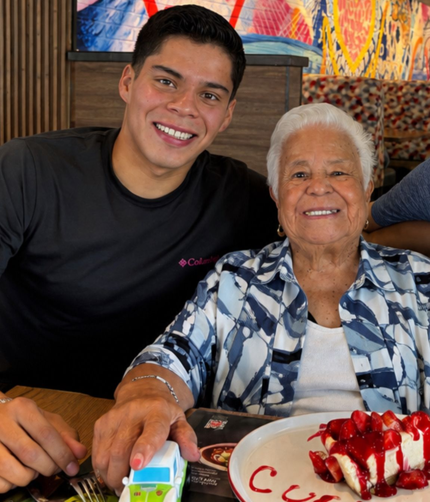

# Proyectos 4

Bienvenido 

Esta página la utilizaré para llevar un registro de las actividades, prácticas y proyectos realizados durante la materia de **Proyectos 4**.

La idea es ir agregando aquí lo que se vaya realizando durante el semestre, junto con una pequeña explicación de cada actividad y las evidencias correspondientes.

---

## Sobre mí

###  Información personal

**Nombre:** Jesús Hernández
**Carrera:** Ingeniería Mecatrónica
**Universidad:** Universidad Iberoamericana Puebla
**Materia:** Proyectos 4
**Periodo:** 2026

### 📷 Mi foto

###  Cosas que me gustan

Algunas de las cosas que me gustan y que forman parte de mi vida son:

*  La natación y los deportes.
*  Correr y mantenerme activo.
*  La ingeniería y la tecnología.
*  La robótica y los sistemas electrónicos.
*  Programar y aprender nuevas herramientas.
*  Los videojuegos.
*  Escuchar música.
*  Pasar tiempo con amigos y familia.
*  Los automóviles y todo lo relacionado con ellos.
*  Aprender cosas nuevas que pueda aplicar en proyectos.

###  ¿Por qué estudio Ingeniería Mecatrónica?

Elegí Ingeniería Mecatrónica porque me interesa la combinación de diferentes áreas como la **electrónica, programación, mecánica y automatización**.

Me gusta la idea de poder diseñar y construir cosas que tengan una función real y que puedan resolver algún problema.

También quiero seguir mejorando mis conocimientos en programación y electrónica, ya que considero que son herramientas importantes para mi futuro profesional.

---

##  ¿Cómo me veo en 5 años?

En cinco años me gustaría verme como un ingeniero mecatrónico con experiencia y trabajando en proyectos relacionados con la tecnología, automatización o desarrollo de sistemas.

Me gustaría haber participado en proyectos importantes y tener los conocimientos suficientes para poder desarrollar mis propias ideas.

También espero seguir aprendiendo y posiblemente comenzar algún proyecto o negocio relacionado con la ingeniería.

A nivel personal, quiero seguir practicando deporte, conocer nuevos lugares y continuar desarrollándome tanto profesional como personalmente.

Mi objetivo no es solamente terminar la carrera, sino seguir aprendiendo y utilizar lo que estudie para crear cosas útiles.

---

##  Syllabus

En esta sección coloque el  **Syllabus de la materia**, proporcionado por el profesor.

El documento contiene información importante sobre la materia, como los objetivos, actividades, contenidos y forma de evaluación.

**[ Ver Syllabus de Proyectos 4](actividades/syllabus.pdf)**

---

##  Objetivo de esta página

El objetivo de esta página es mantener organizada la documentación de las actividades realizadas durante el curso.

Aquí se registrará:

* Qué se hizo.
* Cómo se hizo.
* Qué herramientas se utilizaron.
* Qué resultados se obtuvieron.
* Qué aprendí de cada actividad.
* Las evidencias correspondientes.

---

## Actividades

| # | Actividad | Fecha | Estado |
|---|-----------|-------|--------|
| 1 | [Ejercicio SCAMPER: El Cuerpo Mensajero](actividades/actividad-01.md) | 27/08/2026 | 🟢 Completado |
| 2 | [Modo Explorador: Deporte en adultos mayores](actividades/actividad-02.md) | 02/09/2026 | 🟢 Completado |
| 3 | Por agregar | --/--/2026 | 🟡 Pendiente |
| 4 | Por agregar | --/--/2026 | 🟡 Pendiente |
| 5 | Por agregar | --/--/2026 | 🟡 Pendiente |
---

##  GitHub

Los archivos y códigos de las actividades se podrán almacenar en GitHub para llevar un control de las diferentes versiones del trabajo.

También utilizaré GitHub para mantener organizada la documentación y poder actualizar la página conforme avance el semestre.

---

##  Reflexión

Esta página irá creciendo durante el semestre conforme realice nuevas actividades.

La idea es que al finalizar el curso no solamente tenga los trabajos realizados, sino también un registro de **qué aprendí, qué problemas tuve y cómo fui mejorando durante la materia**.
